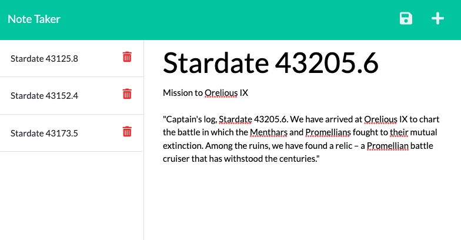

# Note Taker 

## Index

- [Description](#description)
- [Features](#features)
- [License](#)
- [Built With](#built-with)
- [Questions](#questions)

## Description

- Jot down quick notes, record your thoughts, keep a log of your mindfullness journey, or log your captain's notes. Then access your records from anywhere with internet acces using this streamlined note taking application. 

## Features

- Utilizes an Express.js server to handle HTML and API routing requests
- Deployed with Heroku for access from any web browser
- Add and delete notes 

## License

## Built With

## Questions

Feel free to contact me using the information below!

- GitHub Profile: [@scottrohrig](https://github.com/scottrohrig)

- Email: scott.rohrig@gmail.com

- Project Repository/URL: [github.com/.../note-taker](https://github.com/scottrohrig/note-taker)

- Deployed Application: [Note Taker](https://quiet-waters-26398.herokuapp.com/notes)